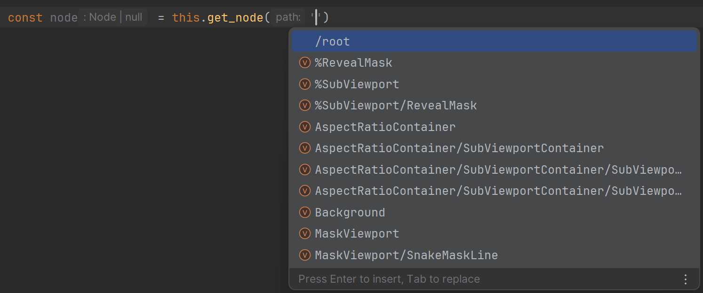
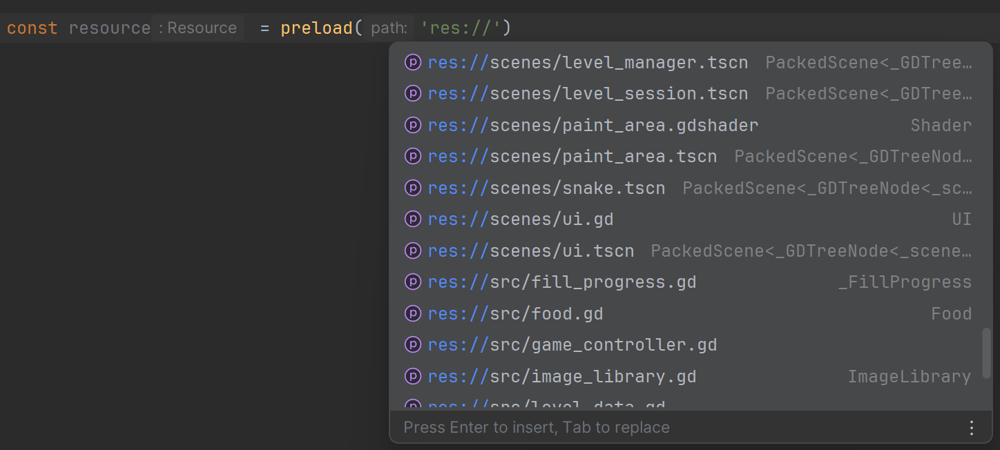

In GDScript, a wrong `$Sprite2D` path only fails when the game runs. Here `this.get_node('Sprite2D')` is typed from your `.tscn` files: the editor completes the path, and the result has the node's real type.

## Nodes from your scene

Say `player.tscn` looks like this, with the script converted from `src/player.ts` attached to the root node:

```text
Player (CharacterBody2D)     ← scripts/player.gd
├── Sprite2D
├── CollisionShape2D
└── HealthBar (ProgressBar)  ← unique name (%HealthBar)
```

Inside `Player`, TypeScript knows that tree:

```ts nocheck
export class Player extends CharacterBody2D {
  @onready sprite: Sprite2D = this.get_node('Sprite2D');
  @onready health_bar: ProgressBar = this.get_node('%HealthBar');

  take_hit(damage: int) {
    this.health_bar.value -= damage;
    this.sprite.modulate = Color.RED;
  }
}
```

```gdscript
class_name Player
extends CharacterBody2D

@onready
var sprite: Sprite2D = self.get_node("Sprite2D")
@onready
var health_bar: ProgressBar = self.get_node("%HealthBar")

func take_hit(damage: int):
	self.health_bar.value -= damage
	self.sprite.modulate = Color.RED
```

`@onready` works as in GDScript: the node is looked up just before `_ready()`. A `%UniqueName` path works from any node in the scene, and so do absolute `/root/...` paths. The output spells the lookup `self.get_node("Sprite2D")` rather than `$Sprite2D`; in Godot the two are the same call.

The editor suggests every path in the scene as you type:



A path that isn't in the scene gives `Node | null`, so a typo shows up as a type error on the line that uses it. `get_node_or_null()` works the same way and adds `| null`. `get_parent()` and `get_child(index)` are typed from the scene too.

## Nodes without a scene

When TypeScript can't know the node (the script isn't attached in any scene, or the path is built at runtime), `get_node()` returns `Node | null`. Check the type yourself, with `gd.as` or `instanceof`:

```ts
export class Hud extends CanvasLayer {
  @onready score_label = gd.as(this.get_node('Score'), Label);

  set_score(score: int) {
    if (this.score_label !== null) {
      this.score_label.text = str(score);
    }
  }
}
```

```gdscript
class_name Hud
extends CanvasLayer

@onready
var score_label = self.get_node("Score") as Label

func set_score(score: int):
	if self.score_label != null:
		self.score_label.text = str(score)
```

## Loading scenes and resources

`load()` and `preload()` know every file in your project. A `.tscn` path gives a `PackedScene` whose `instantiate()` returns the scene's root node, with its script class if it has one:

```ts nocheck
export class Spawner extends Node2D {
  bullet_scene = preload('res://scenes/bullet.tscn');

  fire() {
    let bullet = this.bullet_scene.instantiate();
    bullet.position = this.global_position;
    this.add_child(bullet);
  }
}
```

The editor completes `res://` paths and shows the type each one loads:



A path that doesn't exist still compiles and gives a plain `Resource`. Paths can also be `uid://…`, and resolve to the same type.

## Groups

`get_tree().get_nodes_in_group('enemies')` returns an array typed with the nodes you put in that group in your scenes. A group that no scene uses gives plain `Node`s. `call_group`, `add_to_group` and `is_in_group` take any string, as in GDScript.

```ts
export class Referee extends Node {
  end_round() {
    for (let enemy of this.get_tree().get_nodes_in_group('enemies')) {
      enemy.queue_free();
    }
    this.get_tree().call_group('players', 'celebrate');
  }
}
```

Autoloads from `project.godot` are typed globals too: an autoloaded script is its class, and an autoloaded scene is its root node, with `get_node()` into its tree.

## Project names as types

A few global types list what exists in your project, so your own functions can take only real names:

- `GodotResourceName`: any `res://` file.
- `GodotSceneName`: any `.tscn` file.
- `GodotScriptName`: any `.gd` script.
- `GodotGroupName`: any group used in a scene.

```ts nocheck
export class AssetLoader extends Node {
  load_asset(path: GodotResourceName) {
    return load(path);
  }

  count_in_group(group: GodotGroupName): int {
    return this.get_tree().get_nodes_in_group(group).size();
  }
}
```

`this.load_asset('res://does_not_exist.png')` is then an error. The interfaces behind them (`GodotResources`, `GodotScenes`, `GodotScripts`, `GodotGroups`) map each name to its type, e.g. `GodotScenes['res://player.tscn']` is the scene's root node type.

## Keeping the typings current

`tstogd convert` and `tstogd watch` regenerate these typings, and `watch` updates them as soon as you save a scene in Godot; see [How it works](/typescript-to-gdscript/guide/how-it-works/#tstogd-watch).

## Details

See [scene typings](/typescript-to-gdscript/reference/typings/#scene-typings-features), [the project name types](/typescript-to-gdscript/reference/typings/#global-project-key-union-types) and [`tstogd generate-typings`](/typescript-to-gdscript/reference/typings/#tstogd-generate-typings) in the reference.
